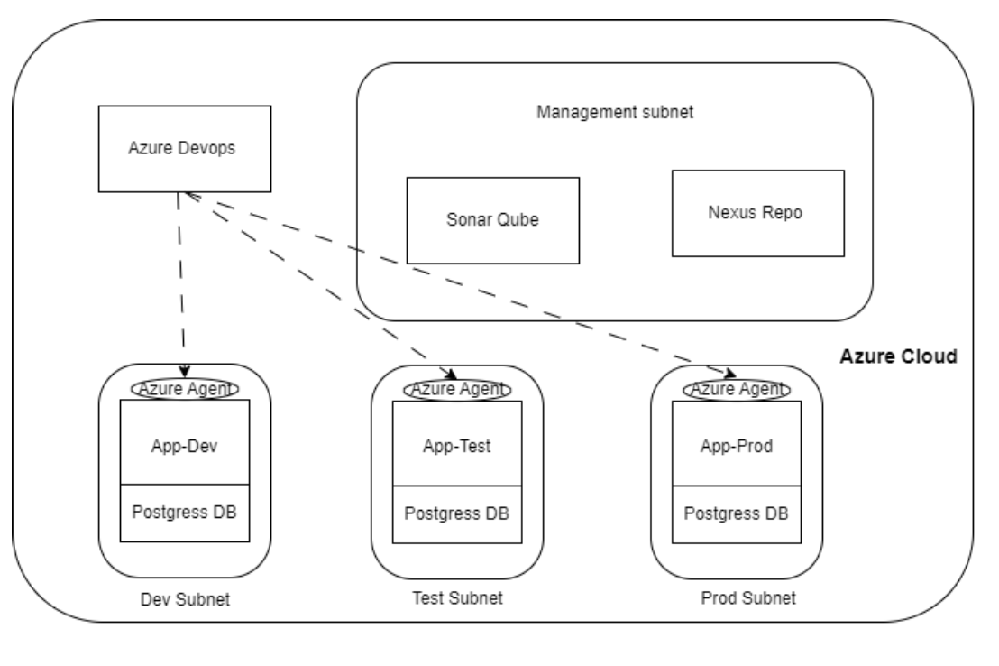

Infrastructure Setup

This repository is used to create the resources in the following picture.




## Classification of Files

- **main.tf**  
  Creates the resource group containing all resources, including the Virtual Network, Subnet, and Public IPs.

- **app_vm.tf**  
  Defines the three VMs that host the application in three envs [dev, test, prod].

- **pipeline_vm.tf**  
  Defines the two VMs that host Nexus and SonarQube.

- **postgress.tf**  
  Defines the PostgreSQL resources in all environments.

- **securityGp.tf**  
  Creates the security groups attached to all subnets, allowing access only from your IP.

## Additional Notes

- All VMs are configured to have the public key from your local machine.  
  Make sure to reference the path to your public key in your variable file. This will be detailed at the end of this file.

- **Environment Variables**  
  You need to export these variables before executing the code:

  ```hcl
  variable "username" {
    type = string
  }

  variable "password" {
    type = string
  }

# Terraform Variables

These values must be set in `terraform.tfvars`:

```hcl
prefix                  = ""  # Project prefix or identifier

location                = ""  # Azure region

envs                    = ["", "", ""]  # Environments (e.g., dev, test, prod)

public_subnet_cidrs     = ["", "", ""]  # CIDR blocks for public subnets

mangement_subnet_cidr   = [""]  # CIDR block for management subnet

ssh_public_key          = "path_to_your_ssh_public_key"  # Path to your SSH public key

vm_count                = 0  # Number of VMs

pipelne_vm_count        = 0  # Number of pipeline VMs

env_mangement           = ""  # Environment management setting

sku                     = ["", "", ""]  # SKU types for resources
